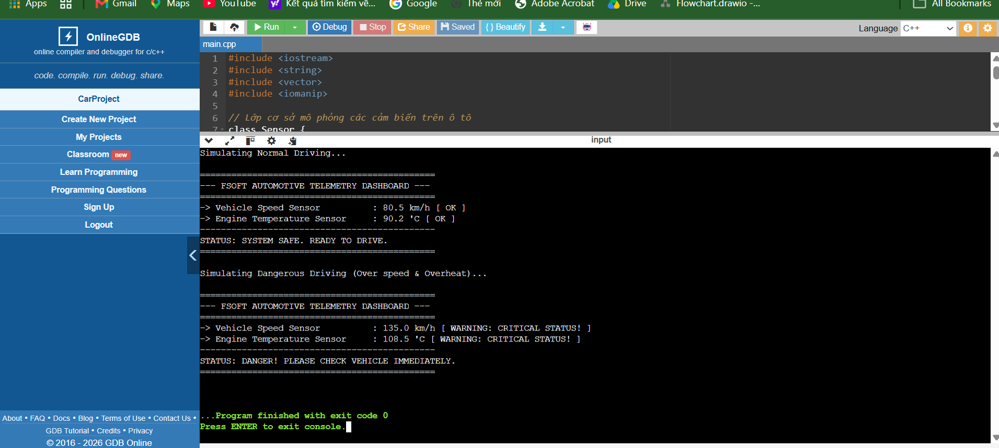

# Hệ thống Giám sát Ô tô - FSoft Automotive Telemetry Dashboard

Dự án mô phỏng hệ thống thu thập dữ liệu từ các cảm biến trên ô tô (Tốc độ, Nhiệt độ động cơ) và đưa ra cảnh báo an toàn thời gian thực. Dự án áp dụng các kiến thức cốt lõi của Lập trình hướng đối tượng (OOP) C++.

# Tính năng chính
- Mô phỏng cảm biến tốc độ (Vehicle Speed Sensor) và cảm biến nhiệt độ động cơ (Engine Temperature Sensor).
- Áp dụng Tính kế thừa (Inheritance) và Hàm ảo/Đa hình (Virtual Functions/Polymorphism).
- Hệ thống tự động phân tích và đưa ra cảnh báo nguy hiểm (`CRITICAL STATUS!`) khi xe vượt quá tốc độ hoặc động cơ quá nhiệt.

# Kết quả chạy thực tế (Demo Result)

